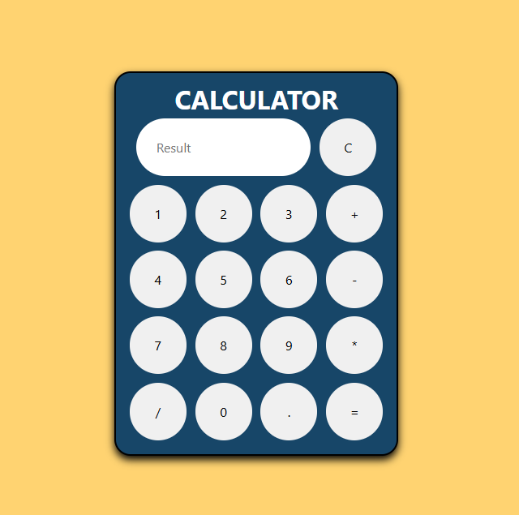

# Simple Calculator 🧮

A clean and responsive calculator built using **HTML**, **CSS**, and **JavaScript**. This calculator can perform basic arithmetic operations and is ideal for beginners learning front-end development.

🔗 **Live Demo**: [Click here to try it out](https://sameerdevhub.github.io/Simple-Calculator/)

---

## ✨ Features

- Basic arithmetic operations: ➕ Addition, ➖ Subtraction, ✖️ Multiplication, ➗ Division
- Clear (C) button to reset input
- Responsive layout that works on desktop and mobile
- Smooth button hover effects

---

## 🖱️ How to Use

1. Click on the number buttons to enter values.
2. Use operator buttons (`+`, `-`, `×`, `÷`) to perform operations.
3. Press `=` to calculate and see the result.
4. Press `C` to clear the screen and start a new calculation.

---

## ⚙️ Tech Stack

- **HTML5**
- **CSS3**
- **JavaScript (Vanilla)**

---

## 📷 Screenshot

  
